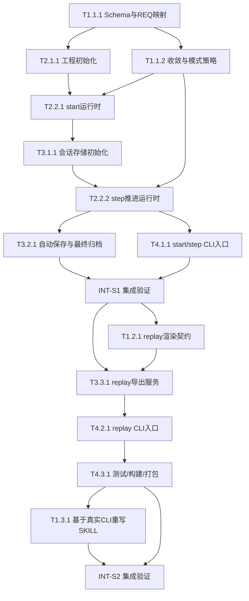

# 任务清单 (Task List) - Sequential Thinking Protocol + CLI v1

> 基于 `.anws/v1/01_PRD.md`、`.anws/v1/02_ARCHITECTURE_OVERVIEW.md`、`ADR-001` 与 `ADR-002` 生成。
> 
> 当前项目尚未创建 `04_SYSTEM_DESIGN/` 与 `AGENTS.md`。本任务清单已按现有架构与 ADR 尽可能细化，后续若补充详细设计，可再做微调。
>
> 当后续进入 `/forge` 且项目仍无 `AGENTS.md` 时，以 `.anws/v1/05_TASKS.md` 作为唯一任务源。

## 📊 Sprint 路线图

| Sprint | 代号 | 核心任务 | 退出标准 | 预估 |
|--------|------|---------|---------|------|
| S1 | Guided Core | 工程骨架 + 协议 schema + `start/step` runtime + 自动保存 | CLI 可启动会话并推进 step；会话 JSON 正常落盘；5 步/8 步收敛提醒生效 | 3-4d |
| S2 | Replay Finish | `replay` 导出 + 集成测试 + CLI 打包 + 基于真实能力回写 skill | 可从已完成会话导出 `replay.md` 到当前目录；测试通过；skill 文档与 CLI 行为一致 | 2-3d |

## 依赖图总览

## 需求追溯基线

| REQ | 来源 | 含义 |
|-----|------|------|
| REQ-001 | PRD §5 | 用最小输入 `name/goal/mode/totalSteps` 启动会话 |
| REQ-002 | PRD §5 | 每一步必须给出模式驱动引导 |
| REQ-003 | PRD §5 | 5 步/8 步按比例提醒收敛 |
| REQ-004 | PRD §5 | 会话默认自动保存与归档 |
| REQ-005 | PRD §5 | 支持 `replay` 与导出到当前目录 |
| REQ-006 | PRD §5 / ADR-002 | v1 只实现 `start` / `step` / `replay` |
| REQ-007 | PRD §5 / ADR-002 | v1 不实现 `resume`，`snapshot/diff` 延后 |

## System 1: Protocol Definition

### Phase 1: Foundation (基础协议)

- [x] **T1.1.1** [REQ-001]: 定义启动输入、会话状态与单步记录 schema
  - **描述**: 使用 `Zod` 建立 `start` 输入、会话状态、单步记录与完成态的统一 schema，并形成共享类型导出。
  - **输入**: `.anws/v1/01_PRD.md` 的最小输入契约；`.anws/v1/03_ADR/ADR_001_TECH_STACK.md` 的 TypeScript + Zod 决策；`.anws/v1/03_ADR/ADR_002_RUNTIME_PROTOCOL.md` 的动作边界。
  - **输出**: `src/types/` 与 `src/protocol/` 下的 schema/type 文件；可复用的 `StartInputSchema`、`SessionSchema`、`StepRecordSchema`。
  - **验收标准**:
    - Given 已有 PRD 与 ADR 定稿
    - When 校验合法的 `start` 输入
    - Then 仅 `name`、`goal`、`mode`、`totalSteps` 通过校验
    - Given 非法 `mode` 或非法 `totalSteps`
    - When 执行 schema 校验
    - Then 返回清晰错误信息
    - Given 运行时需要保存会话
    - When 使用共享类型
    - Then `session.json` 与 `steps/{NN}.json` 的结构一致且可复用
  - **验证类型**: 单元测试
  - **验证说明**: 运行 schema 测试，确认合法输入通过、非法输入被拒绝，且类型导出可被 runtime 与 storage 同时使用。
  - **估时**: 4h
  - **依赖**: 无

- [x] **T1.1.2** [REQ-002]: 定义模式引导与收敛策略规则表
  - **描述**: 将 `explore`、`branch`、`audit` 的阶段引导、5/8 步收敛阈值与最终步行为整理为可调用的规则表或纯函数。
  - **输入**: T1.1.1 产出的 schema/type；`.anws/v1/02_ARCHITECTURE_OVERVIEW.md` 的模式行为与收敛控制章节。
  - **输出**: `src/protocol/mode-policy.ts` 或等效文件；可返回 `phaseHint`、`shouldConverge`、`mustConclude` 的纯逻辑接口。
  - **验收标准**:
    - Given `explore/branch/audit` 任一模式
    - When 查询第 N 步的策略
    - Then 返回对应模式的阶段引导
    - Given `totalSteps = 5`
    - When 查询第 4 步与第 5 步
    - Then 分别触发“开始收敛”与“必须收敛”
    - Given `totalSteps = 8`
    - When 查询第 6 至第 8 步
    - Then 正确反映后半程收敛压力
  - **验证类型**: 单元测试
  - **验证说明**: 通过表驱动测试覆盖三种模式和两种步数配置，确认 phase hint 与 converge 标志完全符合 ADR。
  - **估时**: 3h
  - **依赖**: T1.1.1

### Phase 2: Core (协议输出)

- [x] **T1.2.1** [REQ-005]: 定义 replay 文本渲染契约
  - **描述**: 明确 `replay.md` 与导出到当前目录的 Markdown 结构，包括会话元信息、步骤摘要、收敛标记与最终结论段落。
  - **输入**: T1.1.1 产出的会话/步骤 schema；`.anws/v1/02_ARCHITECTURE_OVERVIEW.md` 的存储策略与回放要求；INT-S1 通过后的真实会话样本。
  - **输出**: `src/replay/replay-template.ts` 或等效模板文件；稳定的 replay Markdown 结构约定。
  - **验收标准**:
    - Given 一个已完成会话
    - When 渲染 replay 文本
    - Then 包含名称、目标、模式、总步数与每步摘要
    - Given 后半程步数触发收敛提醒
    - When 查看 replay
    - Then 能看到收敛提示与最终结论
    - Given 需要导出到当前目录
    - When 使用统一模板
    - Then `replay.md` 与导出文件结构一致
  - **验证类型**: 单元测试
  - **验证说明**: 使用固定 fixture 渲染 replay，检查 Markdown 中关键段落、步骤顺序与最终结论段存在且顺序正确。
  - **估时**: 3h
  - **依赖**: INT-S1

### Phase 3: Polish (协议回写)

- [x] **T1.3.1** [REQ-006]: 基于真实 CLI 行为重写 `sequential-thinking` skill
  - **描述**: 在 CLI 主路径稳定后，将 `sequential-thinking` skill 改写为与真实运行协议一致的 AI-first 手册，重点说明思想、触发条件、模式选择、npm 安装引导与调用边界，而不是停留在 JSON 示例层。
  - **输入**: T4.3.1 产出的稳定 CLI 行为；T1.2.1 产出的 replay 契约；`.windsurf/workflows/craft.md` 的写作风格。
  - **输出**: 更新后的 skill 文档，明确通过 npm 安装 CLI 并以 `sthink` 作为命令入口。
  - **验收标准**:
    - Given CLI 主路径已稳定
    - When 阅读新的 skill 文档
    - Then 文档描述与 `start/step/replay` 行为一致
    - Given v1 已移除 `resume`
    - When 检查 skill 文档
    - Then 不再出现与 v1 决策冲突的动作设计
    - Given mode 与收敛规则已实现
    - When 检查 skill 文档
    - Then 明确体现 `explore/branch/audit` 与 5/8 步节奏控制
  - **验证类型**: 手动验证
  - **验证说明**: 对照 CLI 实际输出与 skill 文档逐段检查，确认不存在能力漂移或过度承诺。
  - **估时**: 4h
  - **依赖**: T4.3.1

## System 2: Runtime Engine

### Phase 1: Foundation (工程初始化)

- [x] **T2.1.1** [REQ-006]: 初始化 CLI 工程骨架与基础脚本
  - **描述**: 建立 `pnpm + TypeScript + Vitest` 工程骨架，创建 `cli/`、`src/`、`tests/` 目录与基础脚本。
  - **输入**: `.anws/v1/03_ADR/ADR_001_TECH_STACK.md` 的技术栈决策；`.anws/v1/02_ARCHITECTURE_OVERVIEW.md` 的最小工程结构；T1.1.1 对目录划分的 schema 需求。
  - **输出**: `package.json`、`tsconfig.json`、基础目录结构、可运行的测试与构建脚本。
  - **验收标准**:
    - Given 新工程初始化完成
    - When 执行安装与基础脚本
    - Then 依赖安装、类型检查与测试脚本可运行
    - Given 目录结构要求已定稿
    - When 检查项目结构
    - Then 包含 `cli/`、`src/protocol/`、`src/runtime/`、`src/storage/`、`src/replay/`、`src/types/`、`tests/`
    - Given 需要后续快速接入实现
    - When 新增模块文件
    - Then 工程脚手架无需返工
  - **验证类型**: 编译检查
  - **验证说明**: 运行基础构建与测试命令，确认工程可编译、测试 runner 可启动、目录结构完整。
  - **估时**: 4h
  - **依赖**: T1.1.1

### Phase 2: Core (会话推进)

- [x] **T2.2.1** [REQ-001]: 实现 `start` 会话创建服务
  - **描述**: 实现基于最小输入创建会话的 runtime 服务，负责生成初始状态、首步上下文与默认存储路径。
  - **输入**: T1.1.1 产出的 `StartInputSchema` 和 `SessionSchema`；T1.1.2 产出的模式与收敛规则；T2.1.1 产出的工程骨架。
  - **输出**: `src/runtime/start-session.ts` 或等效服务；可供 CLI 调用的会话创建接口。
  - **验收标准**:
    - Given 合法的 `start` 输入
    - When 创建会话
    - Then 返回包含 `name`、`goal`、`mode`、`totalSteps`、`currentStep=0` 的初始状态
    - Given 不同 `mode`
    - When 创建会话
    - Then 初始响应中包含对应模式的开局引导
    - Given 非法输入
    - When 尝试创建会话
    - Then 返回 schema 错误而不是静默失败
  - **验证类型**: 单元测试
  - **验证说明**: 测试创建多个不同模式会话，确认返回状态结构、初始提示与错误处理都正确。
  - **估时**: 4h
  - **依赖**: T2.1.1, T1.1.2

- [x] **T2.2.2** [REQ-002]: 实现 `step` 推进服务与阶段提示注入
  - **描述**: 实现单步推进逻辑，接收 `content`，自动补全上下文，更新 `currentStep`、`phaseHint`、`shouldConverge` 与 `mustConclude`。
  - **输入**: T2.2.1 产出的会话创建接口；T1.1.2 产出的模式规则；T3.1.1 产出的存储初始化输出。
  - **输出**: `src/runtime/advance-step.ts` 或等效服务；更新后的会话状态与单步记录结构。
  - **验收标准**:
    - Given 一个已创建会话
    - When 提交一步 `content`
    - Then 正确生成 `stepNumber`、`phaseHint` 与 `shouldConverge`
    - Given `mode = branch`
    - When 推进中间步
    - Then 阶段提示强调有限对比而非无限分支
    - Given 最终步或强制收敛步
    - When 推进一步
    - Then 返回必须收敛的标识并产出最终态所需信息
  - **验证类型**: 单元测试
  - **验证说明**: 使用三种模式与 5/8 步配置跑状态转移测试，确认步数、提示与收敛标志正确。
  - **估时**: 5h
  - **依赖**: T2.2.1, T1.1.2, T3.1.1

### Phase 3: Integration (会话闭环)

- [x] **T2.3.1** [REQ-003]: 实现完成态判定与最终摘要生成
  - **描述**: 在 `step` 进入最后一步或完成态时，统一生成最终状态、摘要占位信息与供 `final.md` 使用的数据。
  - **输入**: T2.2.2 产出的更新会话状态与单步记录；`.anws/v1/03_ADR/ADR_002_RUNTIME_PROTOCOL.md` 中关于完成态、收敛与 `final.md` 的约束。
  - **输出**: `src/runtime/finalize-session.ts` 或等效完成态逻辑。
  - **验收标准**:
    - Given 会话进入最后一步
    - When 执行完成态判定
    - Then 标记会话为完成并提供最终摘要数据
    - Given 未到最后一步
    - When 调用完成态逻辑
    - Then 不错误提前结束会话
    - Given 5 步/8 步模式
    - When 检查完成条件
    - Then 与 ADR 中的收敛规则完全一致
  - **验证类型**: 单元测试
  - **验证说明**: 针对最后一步和非最后一步分别测试，确认完成态只在正确时机触发，并能提供 final 产出所需数据。
  - **估时**: 3h
  - **依赖**: T2.2.2

## System 3: Persistence Layer

### Phase 1: Foundation (存储初始化)

- [x] **T3.1.1** [REQ-004]: 实现会话目录与 `session.json` 初始化
  - **描述**: 根据会话名建立 `.anws/runtime/sequential-thinking/[session-name]/` 目录，并写入初始 `session.json`。
  - **输入**: T2.2.1 产出的初始会话状态；`.anws/v1/03_ADR/ADR_002_RUNTIME_PROTOCOL.md` 的存储决策与重名冲突策略。
  - **输出**: `src/storage/session-store.ts` 或等效模块；已创建的会话目录与 `session.json`。
  - **验收标准**:
    - Given 创建会话成功
    - When 初始化存储
    - Then 自动生成目标目录与 `session.json`
    - Given 同名会话再次创建
    - When 处理目录命名
    - Then 不覆盖已有记录，并按递增序号生成稳定目录名
    - Given 会话状态变更
    - When 读取 `session.json`
    - Then 文件结构与 schema 一致
  - **验证类型**: 集成测试
  - **验证说明**: 创建真实临时目录跑文件系统测试，确认目录、命名与 `session.json` 内容正确。
  - **估时**: 4h
  - **依赖**: T2.2.1

### Phase 2: Core (自动保存与归档)

- [x] **T3.2.1** [REQ-004]: 实现 `steps/{NN}.json` 自动保存与 `final.md` 归档
  - **描述**: 在每次 `step` 后自动保存单步记录，并在会话完成后生成 `final.md` 与最终 session 状态。
  - **输入**: T2.2.2 产出的单步记录；T2.3.1 产出的完成态数据；T3.1.1 产出的会话目录与 `session.json`。
  - **输出**: `steps/{NN}.json`、更新后的 `session.json`、`final.md`。
  - **验收标准**:
    - Given 每执行一步 `step`
    - When 保存记录
    - Then 生成对应编号的 `steps/{NN}.json`
    - Given 会话完成
    - When 执行归档
    - Then 生成 `final.md` 且 `session.json` 标记为完成态
    - Given 多步连续推进
    - When 检查落盘内容
    - Then 步骤编号、内容顺序与保存时间一致
  - **验证类型**: 集成测试
  - **验证说明**: 跑完整 5 步会话流程，检查每步文件、最终文件和 session 状态是否齐全且顺序正确。
  - **估时**: 5h
  - **依赖**: T3.1.1, T2.2.2, T2.3.1

### Phase 3: Integration (回放导出)

- [x] **T3.3.1** [REQ-005]: 实现 replay 读取与当前目录导出服务
  - **描述**: 读取已完成会话的 `session.json` 与 `steps/*.json`，生成 `replay.md`，并支持导出到当前目录。
  - **输入**: T1.2.1 产出的 replay 渲染契约；T3.2.1 产出的完整会话目录与步骤文件。
  - **输出**: `src/storage/replay-store.ts` 或等效模块；会话目录下的 `replay.md`；当前目录导出的 `[session-name]-replay.md`。
  - **验收标准**:
    - Given 一个已完成会话目录
    - When 执行 replay 生成
    - Then 生成会话目录内的 `replay.md`
    - Given 需要导出到当前目录
    - When 执行导出
    - Then 生成 `[session-name]-replay.md`
    - Given 会话不完整或文件缺失
    - When 执行 replay
    - Then 返回明确错误，而不是生成残缺文件
  - **验证类型**: 集成测试
  - **验证说明**: 使用已完成会话 fixture 测试 replay 生成与导出，同时覆盖文件缺失场景的错误处理。
  - **估时**: 4h
  - **依赖**: T1.2.1, T3.2.1

## System 4: CLI Shell

### Phase 1: Core Commands (主路径命令)

- [x] **T4.1.1** [REQ-006]: 实现 `start` / `step` CLI 入口与最小参数解析
  - **描述**: 提供 CLI 主入口，支持 `start` 与 `step` 的参数接收、错误提示与 runtime 调用，不引入复杂命令框架。
  - **输入**: T2.1.1 产出的工程骨架；T2.2.1 的 `start` 服务；T2.2.2 的 `step` 服务；ADR-001 的原生 CLI 决策。
  - **输出**: `cli/index.ts` 与 `src/cli/` 下命令解析实现；可运行的 `start` / `step` CLI。
  - **验收标准**:
    - Given 合法的 `start` 参数
    - When 调用 CLI
    - Then 成功创建会话并输出当前引导信息
    - Given 合法的 `step` 输入
    - When 调用 CLI
    - Then 成功推进一步并输出阶段提示
    - Given 缺失参数或非法值
    - When 调用 CLI
    - Then 输出清晰错误，不进入错误状态
  - **验证类型**: 集成测试
  - **验证说明**: 从命令行层触发 `start` 与 `step`，确认参数解析、错误处理与 runtime 输出正确连接。
  - **估时**: 5h
  - **依赖**: T2.2.2

- [x] **INT-S1** [MILESTONE]: S1 集成验证 — Guided Core
  - **描述**: 验证 Sprint 1 的退出标准，确认 CLI 已能从 `start` 到多次 `step` 完成基础会话推进，并正确自动保存。
  - **输入**: T1.1.1、T1.1.2、T2.1.1、T2.2.1、T2.2.2、T2.3.1、T3.1.1、T3.2.1、T4.1.1 的产出。
  - **输出**: S1 集成验证报告（通过/失败 + 问题清单）。
  - **验收标准**:
    - Given S1 任务全部完成
    - When 使用 CLI 启动一个 5 步会话并推进至少到第 4 步
    - Then 会话状态、单步记录与收敛提醒全部正确
    - Given 会话文件已落盘
    - When 检查 `.anws/runtime/sequential-thinking/[session-name]/`
    - Then `session.json` 与 `steps/*.json` 齐全且顺序正确
    - Given 发生参数错误或非法输入
    - When 使用 CLI 运行
    - Then 错误能被识别且不会破坏已有会话记录
  - **验证类型**: 集成测试
  - **验证说明**: 运行一条完整的 start/step 验证路径，检查终端输出与落盘文件，并记录发现的问题。
  - **估时**: 3h
  - **依赖**: T3.2.1, T4.1.1

### Phase 2: Replay & Release (回放与交付)

- [x] **T4.2.1** [REQ-005]: 实现 `replay` CLI 入口与导出选项
  - **描述**: 提供 `replay` CLI 入口，读取会话名并触发 replay 生成与当前目录导出；文档层需保证该能力可通过公开 CLI 入口被清晰调用。
  - **输入**: T3.3.1 产出的 replay 读取/导出服务；T4.1.1 的 CLI 主入口。
  - **输出**: 可运行的 `replay` CLI 命令；对应的终端输出与导出文件。
  - **验收标准**:
    - Given 已完成会话
    - When 调用 `replay`
    - Then 成功生成或输出 replay 信息
    - Given 需要保存到当前目录
    - When 使用导出路径选项或默认导出行为
    - Then 生成 `[session-name]-replay.md`
    - Given 会话不存在
    - When 调用 `replay`
    - Then 返回清晰错误信息
  - **验证类型**: 集成测试
  - **验证说明**: 通过 CLI 调用 replay，检查终端输出、生成文件与错误场景。
  - **估时**: 3h
  - **依赖**: T3.3.1, T4.1.1

- [x] **T4.3.1** [REQ-006]: 建立 CLI 测试、构建与可执行交付路径
  - **描述**: 补齐关键测试、构建配置与发布前检查，使 CLI 可以稳定编译、测试并生成可执行分发产物；对外交付口径收敛为 npm 安装与统一命令入口。
  - **输入**: T4.2.1 产出的完整主路径 CLI；ADR-001 的 `Vitest` 与 `dist/` 决策。
  - **输出**: 构建配置、关键集成测试、可执行构建产物、发布前检查脚本。
  - **验收标准**:
    - Given 主路径功能已完成
    - When 运行测试套件
    - Then 核心单元测试与集成测试全部通过
    - Given 需要构建 CLI
    - When 执行构建
    - Then 成功生成 `dist/` 产物
    - Given 发布前检查
    - When 执行类型检查、测试与构建
    - Then 没有阻塞性错误
  - **验证类型**: 编译检查
  - **验证说明**: 运行完整的类型检查、测试与构建流程，确认 `dist/` 生成成功且核心路径稳定。
  - **估时**: 4h
  - **依赖**: T4.2.1

- [x] **INT-S2** [MILESTONE]: S2 集成验证 — Replay Finish
  - **描述**: 验证 Sprint 2 的退出标准，确认 replay 可导出、CLI 可构建，且 skill 文档已对齐真实行为。
  - **输入**: T1.2.1、T1.3.1、T3.3.1、T4.2.1、T4.3.1 的产出。
  - **输出**: S2 集成验证报告（通过/失败 + 问题清单）。
  - **验收标准**:
    - Given S2 任务全部完成
    - When 执行一条完整的 start → step → replay 路径
    - Then 会话可被回放并成功导出到当前目录
    - Given CLI 构建完成
    - When 检查 `dist/` 产物与核心命令
    - Then 主路径可执行且行为符合 ADR-002
    - Given skill 文档已更新
    - When 对照真实 CLI 行为检查
    - Then 无能力漂移或过时描述
  - **验证类型**: 集成测试
  - **验证说明**: 跑全链路集成验证，并对照文档与真实行为，记录通过结果或缺陷清单。
  - **估时**: 3h
  - **依赖**: T1.3.1, T4.3.1

## 🎯 User Story Overlay

### US-001: 作为 AI Agent，我能用最少输入启动一次顺序思考会话 (P0)
**涉及任务**: T1.1.1 → T1.1.2 → T2.1.1 → T2.2.1 → T3.1.1 → T4.1.1  
**关键路径**: T1.1.1 → T1.1.2 → T2.1.1 → T2.2.1 → T3.1.1 → T4.1.1  
**独立可测**: ✅ S1 结束即可演示  
**覆盖状态**: ✅ 完整

### US-002: 作为 AI Agent，我能在每一步获得模式引导与收敛提醒，且状态自动保存 (P0)
**涉及任务**: T1.1.2 → T2.2.2 → T2.3.1 → T3.2.1 → T4.1.1 → INT-S1  
**关键路径**: T1.1.2 → T2.2.2 → T3.2.1 → INT-S1  
**独立可测**: ✅ S1 结束即可演示  
**覆盖状态**: ✅ 完整

### US-003: 作为 AI Agent，我能回放已完成会话，并将结果保存到当前目录 (P1)
**涉及任务**: INT-S1 → T1.2.1 → T3.3.1 → T4.2.1 → T4.3.1 → INT-S2  
**关键路径**: T1.2.1 → T3.3.1 → T4.2.1 → T4.3.1 → INT-S2  
**独立可测**: ✅ S2 结束即可演示  
**覆盖状态**: ✅ 完整

### US-004: 作为维护者，我能在 CLI 稳定后用真实行为回写 skill 文档 (P1)
**涉及任务**: T4.3.1 → T1.3.1 → INT-S2  
**关键路径**: T4.3.1 → T1.3.1 → INT-S2  
**独立可测**: ✅ S2 结束即可验证  
**覆盖状态**: ✅ 完整

## 🌊 Wave 1 建议

- `T1.1.1`
- `T1.1.2`
- `T2.1.1`

## 统计

- **总任务数**: 13
- **Sprint 数**: 2
- **P0/P1/P2 说明**: 本清单以工程依赖和里程碑为主，需求优先级已通过 User Story Overlay 体现
- **总预估工时**: 50h
